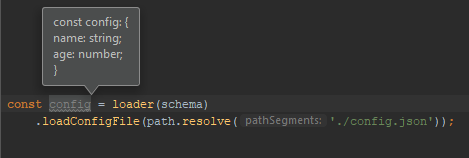

# rc.ts
[](https://npmjs.com/package/rc.ts)
[](https://bundlephobia.com/result?p=rc.ts)

There's an ungodly amount of similar packages, so I will keep the introduction brief:

`rc.ts` is a no-nonsense runtime-configuration loader and validator for TypeScript applications.  All you have to do is define a schema for your config and `rc.ts` will use it for _both compile time and runtime_ type-safety when it loads a config file.

### Is `rc.ts` for you?
#### Pros
* It's fairly un-opinionated.
* It's very lightweight (almost nothing if you are already using [io-ts](https://github.com/gcanti/io-ts))
* Config schemas are written in a simple, easy-to-understand format.
* Types are enforced at compile time _and_ runtime without needing to duplicate your schema.
* It provides a few helpers that abstract away the complexity of implementing things like schemas with default values.
#### Cons
* It relies on [io-ts](https://github.com/gcanti/io-ts), which may be a deal-breaker for some folks, but I would encourage them to give it a chance.
* Since the design is very minimal, only `.json` and `.js` config formats are supported (out of the box, at least).  Sorry, YAML enthusiasts.

## Installation
You can install `rc.ts` via npm or yarn.  You will also need to install the `io-ts` peer dependency.

```
$ npm install rc.ts io-ts
```
or
```
$ yarn add rc.ts io-ts
```

## Getting Started
### Defining a Schema
**schema.ts**
```typescript
import * as t from 'io-ts';

// Don't be swayed by this! It actually integrates with TS very well
export let schema = t.type({
  name: t.string,
  age: t.number
});
```

### Loading a Config
**config.json**
```json
{
  "name": "Tanner Nielsen",
  "age": 21
}
```

**your-app.ts**
```typescript
import * as path from 'path';
import loader from 'rc.ts';
import {schema} from './schema';

const config = loader(schema)
  .loadConfigFile(path.resolve('./config.json'));
```

### Reaping the Benefits
When you use the above code in your project, the `loadConfigFile()` function is able to infer the types from the schema exactly as you would expect it to:



Additionally, if you load a bad config file, a descriptive error will be thrown:

```
Invalid value 0 supplied to : { name: string, age: number }/name: string
```

## More Advanced Use
### Alternative Loaders
There are a few other functions that can be used in addition to `loadConfigFile()`:

#### `loadConfigObject(data)`
This function works just like `loadConfigFile()` except that an object is passed rather than a filepath.  This could be useful if you wanted to load a YAML file or some other format (using a separate tool) and needed to validate the JS object.

#### `validateConfigObject(data)`
Like `loadConfigObject()`, this function receives a JS object, but it either returns `true` if the data is valid, or an array of strings describing the errors.  This could be useful if you need more control over how the errors are handled.

### Tips on `io-ts` Types
#### Complex Types
A schema can be much more complex than the basic example shown above.  See [io-ts](https://github.com/gcanti/io-ts) for more information on how to define types.

#### Helper Functions for `io-ts`
`io-ts` is beautiful in many ways, but its functional programming influences can be confusing to newcomers.  To help get over some of the hurdles I faced myself, I included a few helper functions for common tasks:

##### `withDefault(type, defaultValue)`
This function allows a type to have a fallback value when the input is undefined.  This differs from the `fallback` function provided by `io-ts-types` in that it only falls back if the value is missing, _not_ if it's present but invalid.  Here's an example of how to use it:

```typescript
import * as t from 'io-ts';
import {withDefault} from 'rc.ts';

let vechicleType = t.keyof({
  none: null,
  car: null,
  truck: null
});

export let schema = t.type({
  name: t.string,
  age: t.number,
  vehicle: withDefault(vechicleType, 'none')
});
```

With the above schema, the `vehicle` value can be omitted and it will default to `'none'` when it is loaded.  However, passing `'plane'` will still cause an error to be thrown, because having invalid values silently fallback to defaults  (as the `fallback` function does) could cause confusion. 

## Author
Tanner Nielsen <tannerntannern@gmail.com>

[Website](https://tannernielsen.com) | [GitHub](https://github.com/tannerntannern)

## License
MIT